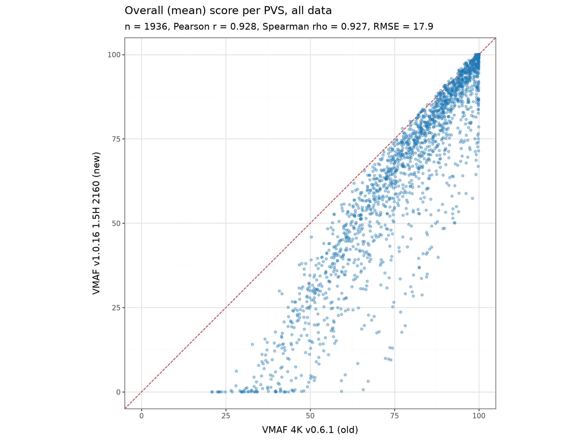
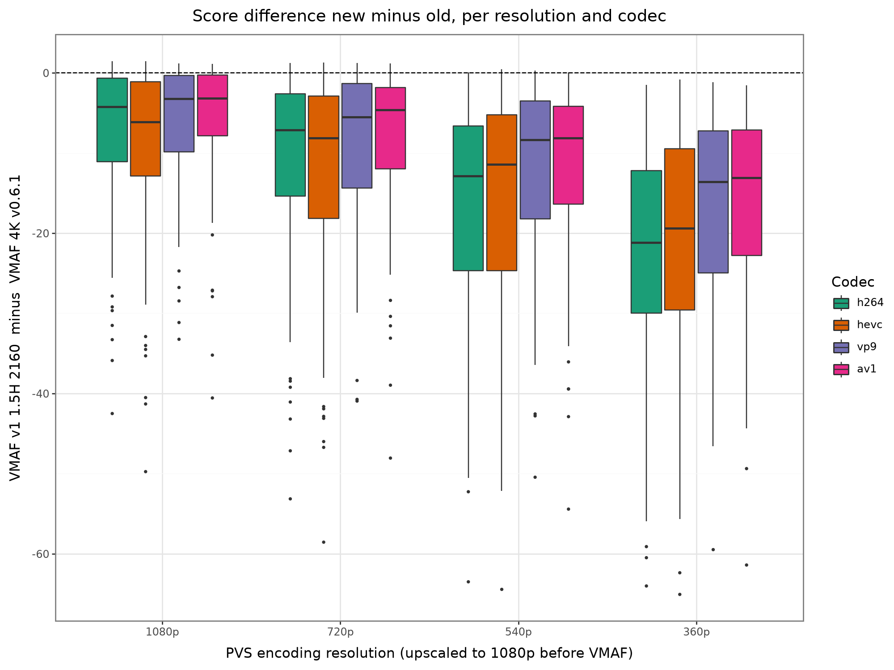
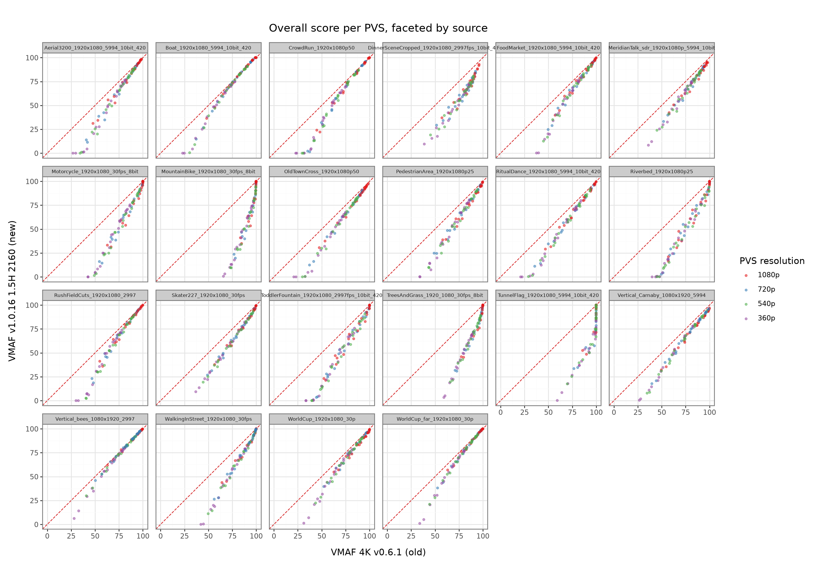
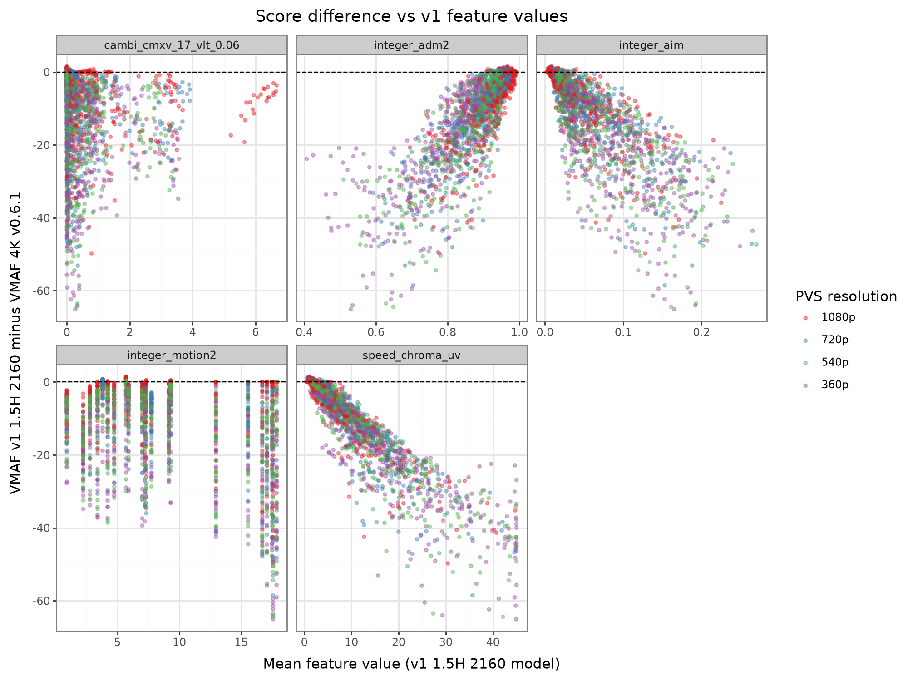
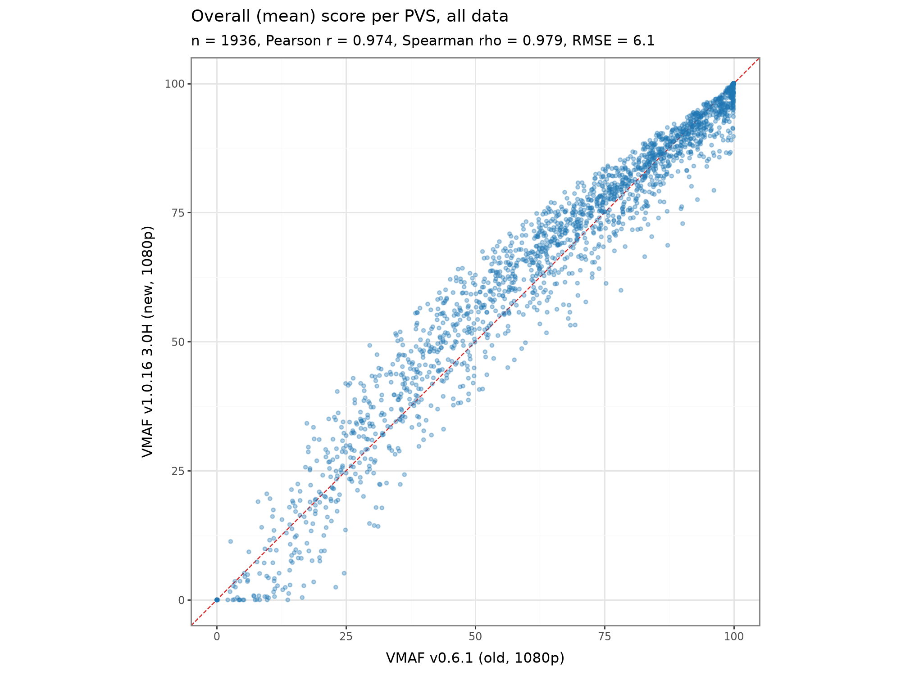

# VMAF v1 vs VMAF v0.6.1 on the AOM CTC a2_2k set

Author: Werner Robitza

This repository compares the new VMAF v1.0.16 models with the old VMAF v0.6.1 models.
The question was whether the two generations give similar overall scores on ordinary bitrate-ladder encodes, or if they differ significantly.

This repository contains:

- the scripts
- per-video results
- plots for a comparison

## Requirements

You need:

- [`uv`](https://docs.astral.sh/uv/)
- a system ffmpeg with libx264, libx265, libvpx and SVT-AV1 for encoding
- about 20 GB of fast disk available
- a fast CPU (otherwise you're going to wait for days for these results)

The scripts locate the data relative to their own location, so just clone the repo wherever you want.

```
git clone https://github.com/slhck/vmaf-v1-vs-v0
cd vmaf-v1-vs-v0
```

Download the 22 `a2_2k` source videos into `src/`. From the repository root, run:

```sh
mkdir -p src
wget --recursive --no-parent --no-directories --accept='*.y4m' \
  --directory-prefix=src \
  https://media.xiph.org/video/aomctc/test_set/a2_2k/
```

The `.y4m` files must be directly inside `src/`, not in another `a2_2k/` subdirectory. Verify all downloads against the checksums included in this repository:

```sh
(cd src && md5sum --check ../a2_2k.md5)
```

The command should report `OK` for all 22 files.

Download and unpack the latest BtbN static ffmpeg build. The scoring script expects its ffmpeg executable at `bin/ffmpeg-master-latest-linux64-gpl/bin/ffmpeg`, so keep the directory name created by the archive:

```sh
mkdir -p bin
wget --output-document=/tmp/ffmpeg-master-latest-linux64-gpl.tar.xz \
  https://github.com/BtbN/FFmpeg-Builds/releases/download/latest/ffmpeg-master-latest-linux64-gpl.tar.xz
tar --extract --xz --file=/tmp/ffmpeg-master-latest-linux64-gpl.tar.xz \
  --directory=bin
bin/ffmpeg-master-latest-linux64-gpl/bin/ffmpeg -version
```

The final command should print the ffmpeg version and confirm that the executable is in the location used by `scripts/run_vmaf.py`.

Install the ffmpeg quality metrics tool. The simplest way is:

```bash
uvx ffmpeg-quality-metrics
```

which fetches version 3.12.1 or newer from PyPI. `scripts/run_vmaf.py` uses that by default. If you want a local checkout instead, clone https://github.com/slhck/ffmpeg-quality-metrics, run `uv sync`, and set the `FQM_CHECKOUT` environment variable to the checkout path before running the script.

Run:

```bash
uv run scripts/encode_ladder.py
```

to create the ladder in `pvs/`. This took about 45 minutes on a fast 32-core machine.

Run:

```bash
uv run scripts/run_vmaf.py pvs 14 2
```

to score every encode with every model. This took about 2.5 hours.

Run

```bash
uv run scripts/aggregate.py
uv run scripts/plots.py
```

to summarize and plot the results.

## Video sources and encodings

We used the 22 sources of the AOM Common Test Conditions class A2 set. They are 1080p (three are 1080x1920 portrait), 2 seconds long, and a mix of 8-bit and 10-bit 4:2:0.

From each source we made a ladder of 88 encodes with `scripts/encode_ladder.py`, 1936 files in total. Each source was encoded at 4 resolutions (1080p, 720p, 540p, 360p short side) with 4 encoders and a CRF sweep. The encodes sit in `pvs/`.

Encoder settings for the ladder:

- x264, preset medium, CRF 18, 23, 28, 33, 38, 43
- x265, preset fast, CRF 18, 23, 28, 33, 38, 43
- libvpx-vp9, good quality, cpu-used 4, CRF 20, 30, 40, 50, 60
- SVT-AV1, preset 8, CRF 20, 30, 40, 50, 60

Downscaling used bicubic. The bit depth was kept from the source.

Every encode was scored against its source with five VMAF configurations:

- `v0_4k`: `vmaf_4k_v0.6.1.json` (the 4k model from v0.6.1)
- `v0_1080`: `vmaf_v0.6.1.json` (the default 1080p model from v0.6.1 – the one most people would use)
- `v1_1d5h_2160`: `vmaf_v1.0.16_1d5h_2160.json` (the 2160p model from v1.0.16, scoring at 1.5H assumed viewing distance)
- `v1_3d0h_1080`: `vmaf_v1.0.16_3d0h.json` (the 1080p model from v1.0.16, scoring at 3H assumed viewing distance)
- `v1_1d5h_2160_8bit`: same model as `v1_1d5h_2160`, but without the 10-bit conversion

All configurations except the last convert both inputs to 10-bit before scoring, as recommended for the v1 models. We upscale each encode back to the source resolution with bicubic before it runs libvmaf, so both model generations see the same pixels.

## Scoring

Scoring uses `ffmpeg-quality-metrics` version 3.12.1, which wraps ffmpeg's `libvmaf` filter. The v1 models need a libvmaf newer than 3.2.0, which no released ffmpeg ships yet. We used the `ffmpeg-master-latest-linux64-gpl` build from BtbN (ffmpeg N-126492, dated 2026-09-10), which bundles libvmaf from git master.

`scripts/run_vmaf.py` runs the tool for every encode and model, 14 jobs in parallel with 2 libvmaf threads each, and writes one JSON per (model, encode) to `results/`. Each JSON has the per-frame VMAF score and every feature the model computes, plus the global mean, median, min, max and standard deviation. This is the standard output from ffmpeg-quality-metrics.

## Scripts and Results

`scripts/aggregate.py` collects all JSON files into:

- `analysis/overall.csv`: one row per (model, encode) with the global VMAF statistics, all feature statistics, and the encode's bitrate.
- `analysis/overall_wide.csv`: one row per encode, one column per model.
- `analysis/frames.parquet`: one row per (model, encode, frame), all features. Not in git because of its size. Rerun the aggregation to recreate it.

`scripts/plots.py` writes `analysis/summary.md` and the plots in `analysis/plots/`:

- `scatter_<new>_vs_<old>_*.png`: overall score of one model against another, plain, colored, or faceted by resolution, codec, or source.
- `rq_<codec>_partN.png`: rate-quality curves per source, one column per model. Old models are dashed, new models solid.
- `diff_*_box_res_codec.png`: score difference new minus old, by resolution and codec.
- `perframe_*.png`: agreement of per-frame scores within an encode.
- `feature_attribution.png`: score difference against the v1 feature values.
- `score_hist.png`: distribution of overall scores per model.

Summarized result tables can be found in `analysis/summary.md`.

## Findings

### 4K model

The 4K model pair (`v1_1d5h_2160` vs `v0_4k`) disagrees a lot. Over the 1936 encodes, Pearson r is 0.93 and the RMSE is 17.9 points. The new model almost never scores higher than the old one. Near the top of the scale, both agree (old 95 to 100 gives new 90 to 100), but there is a bigger gap below that. An encode which achieves 75 for the old model could become a 10 or 80 with the new model.



*Overall mean score per encode. The dashed line marks equal scores from both models.*

42 encodes that the old model rates between 21 and 59 get 0 from the new model. The gap gets bigger as the encoding resolution is lowered (RMSE 11 at 1080p, 24 at 360p).
This is likely because its prediction is clipped at 0 rather than going negative. The old 1080p model also gives them 0 to 19 — only the old 4K model rates them 21 to 59.



*New-minus-old score differences by encoding resolution and codec. The distributions move farther below zero at lower resolutions.*

The disagreement is strongly source dependent. Each source follows its own curve relative to the diagonal. MountainBike, Riverbed, TunnelFlag and TreesAndGrass score 20 to 27 points lower on average with VMAF v1, while Boat and Vertical_bees differ by only 2 to 5 points.



*Overall mean scores split by source. The distance from the dashed equality line varies substantially between sources.*

Note that the two models (v1 and v0) have different sets of input features, so it is not a straight comparison. Notably, v0 focuses on luma-only (and this is something the authors themselves noted in their [own blog article](https://netflixtechblog.com/vmaf-v1-good-is-not-good-enough-60d7e4244ea8)): ADM, motion, and VIF. The new v1 model uses CAMBI (the banding detector), a chroma feature (`speed_chroma_uv`), ADM again (but with changed parameters), and motion (albeit slightly different, capped). The v1 version is therefore much more sensitive to chroma degradations.

It does not surprise, then, that he score changes are most strongly associated with `speed_chroma_uv` (Spearman rho ~= -0.94). The ADM features explain a major part of the differences, too (rho about 0.85). CAMBI and motion have much weaker associations. But this is likely dependent on the choice of sources, and the fact that our encodes don't necessarily try to add heavy banding.

Controlling for the old 4K score and ADM, the partial rho for `speed_chroma_uv` remains about -0.82, for ADM about 0.65, and for CAMBI about -0.44. Chroma, therefore, is the best explanation of the difference.



*New-minus-old score differences against selected mean VMAF v1 feature values. Color indicates the encoding resolution.*

### 1080p model

The 1080p model pair (`v1_3d0h_1080` vs `v0_1080`) agrees much better, almost perfectly. Pearson r is 0.97, RMSE 6.1. There is no overall bias.



*Overall mean score per encode. Scores stay much closer to the dashed equality line than for the 4K pair.*

### Other factors

The two _new_ models agree with each other almost perfectly (r 0.999, RMSE 2.4). The 10-bit conversion makes no difference (RMSE 0.3).

Within an encode, the per-frame scores of old and new correlate with a median r of 0.87 for both pairs.

## Acknowledgements

Claude Fable 5.1 has been used to generate the analysis scripts.

## Licenses

The a2_2k sources are owned by their respective contributors and licensed as stated in the copyright files that ship with them. The scripts in this repository are MIT licensed.
